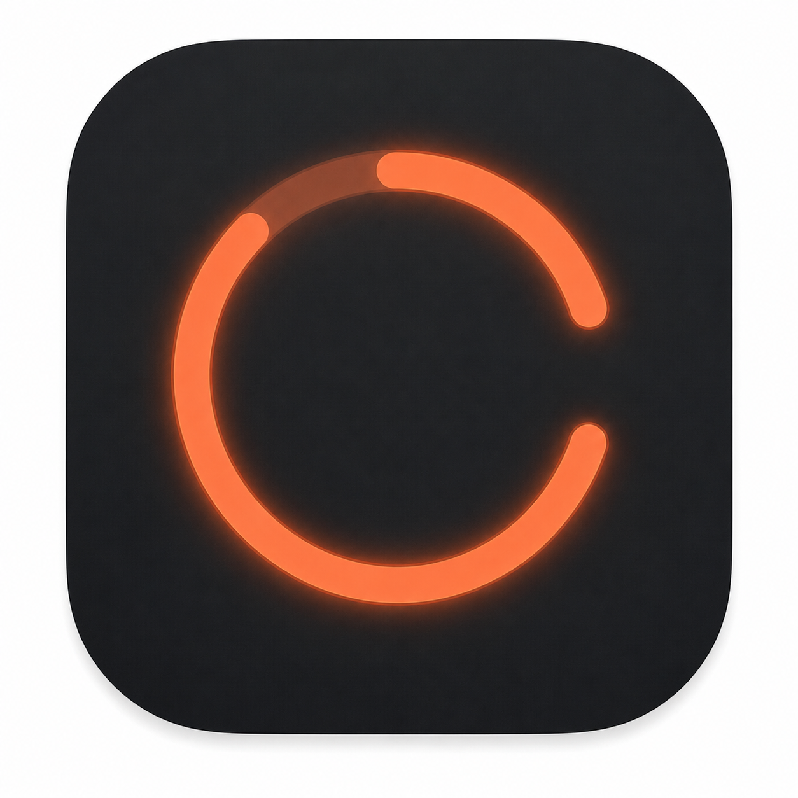
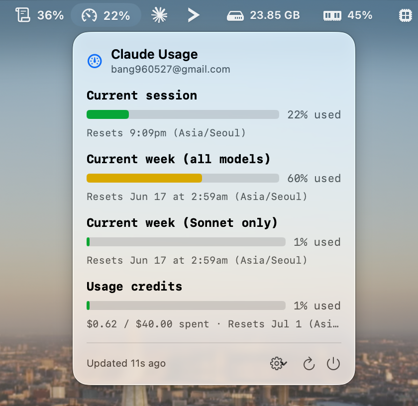
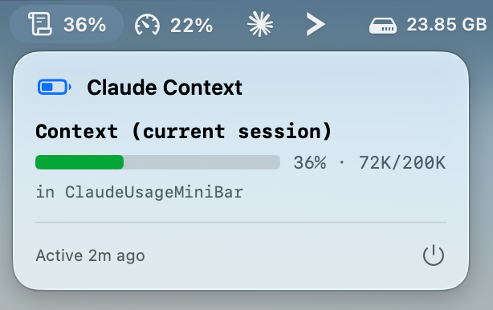

<p align="center">
  
</p>

<h1 align="center">Claude Usage</h1>

A lightweight, native macOS **menu bar app** that shows your Claude Code usage — current
session (5‑hour), weekly (all models / Sonnet), and pay‑as‑you‑go credits — in real time,
without launching Claude Code or spending Agent SDK credits. A second widget tracks the
**context‑window usage** of the session you're currently typing in.

<p align="center">
  
</p>

<p align="center">
  
</p>

- **100% local.** No backend, no telemetry, no cookies — it reuses the OAuth token already
  in your Keychain from Claude Code.
- Pure Swift + SwiftUI + `MenuBarExtra`. No Electron, no dependencies. Notarized.

## Install

**Homebrew**
```bash
brew install bread-bang/tap/claude-usage
```
After the tap is added, `brew install claude-usage` works too. The build is notarized, so
it opens with no Gatekeeper warnings.

**Build from source**
```bash
git clone https://github.com/Bread-bang/claude-usage.git
cd claude-usage
./scripts/bundle.sh --open
```

**Requirements:** macOS 13+ and Claude Code signed in (run `claude` once so the Keychain
item exists). To start it at login: System Settings → General → Login Items → add
*Claude Usage.app*.

## Features

- Current session (5‑hour), current week (all models and Sonnet only), and usage credits —
  each with a utilization bar and its reset time.
- **Context‑window widget:** a separate menu‑bar item showing how full the context is in
  the Claude Code session you last typed in (e.g. `36%`), with automatic 200K vs 1M window
  detection. It follows whichever terminal pane has focus — no Accessibility permissions.
- Menu‑bar number for the window of your choice, with traffic‑light colors.
- Selectable icon and refresh interval (30s / 1m / 5m); settings and the last report
  persist across launches.
- Keeps showing the last good data with a subtle warning when a refresh fails, and backs
  off on rate limits.

## Privacy & trust

- The only network request is `GET https://api.anthropic.com/api/oauth/usage` — the same
  endpoint Claude Code uses. Nothing is sent anywhere else; no analytics.
- The token is read from Claude Code's Keychain item through Apple's `/usr/bin/security`
  tool and held only in memory for each request — never written to disk or logged.
- The context widget is local too: it reads occupancy from Claude Code's own transcript
  files under `~/.claude/projects/` and adds an idempotent hook to `~/.claude/settings.json`
  (preserving existing hooks) to learn which session is active. Nothing leaves your machine.

## Development

```bash
swift run               # run from source
open Package.swift       # or open in Xcode
./scripts/bundle.sh      # build dist/Claude Usage.app (locally signed)
./scripts/release.sh     # Developer ID-signed + notarized .zip for a release
```

Getting repeated Keychain prompts on every rebuild? Run `./scripts/create-signing-cert.sh`
once. Architecture and the reverse‑engineering notes (endpoint choice, Keychain access,
token refresh) are in **[DESIGN.md](DESIGN.md)**.

## Limitations

- Relies on the **undocumented** `api.anthropic.com/api/oauth/usage` endpoint and on Claude
  Code's Keychain format — both can change without notice.
- The `claude.ai/api/.../usage` endpoint is intentionally not used (Cloudflare‑walled for
  non‑browser clients; see [DESIGN.md](DESIGN.md)).

## License

[MIT](LICENSE) © Bread-bang
